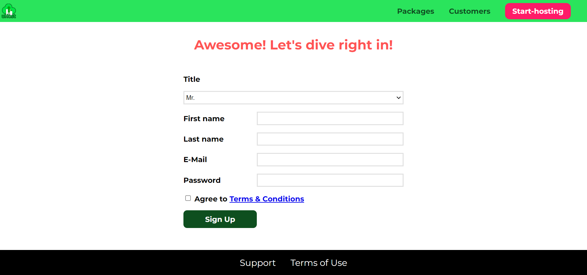

# ProjectUHost

ProjectUHost is a fictional web hosting company website which i built when i was learning html and css. This project is developed by using vanilla css, html and javascript

# Features

Home Page

- Information three different hosting plans.

Packages Page

- Detailed information about the hosting packages.

Customers Page

- Details about company cutomers.

Start-Hosting Page

- Includes registration page

# Screenshots

- Home Page

  

- Packages Page

  

- Customers Page

  

- Start Hhosting Page

# Built With

- HTML
- CSS
- JavaScript

# How to run this Project

Just download the zipped file and double click on the `index.html` file in root folder in order to open it in your default browser or go through the live demo given below.

# Live demo

- [Run Project here](https://javidvajid.github.io/ProjectUhost/)

# Acknowledgements

- [Udemy - CSS - The Complete Guide (incl. Flexbox, Grid & Sass)](https://www.udemy.com/course/css-the-complete-guide-incl-flexbox-grid-sass/)

# Show your support

- If you like the project then don't forget to give a ⭐.
